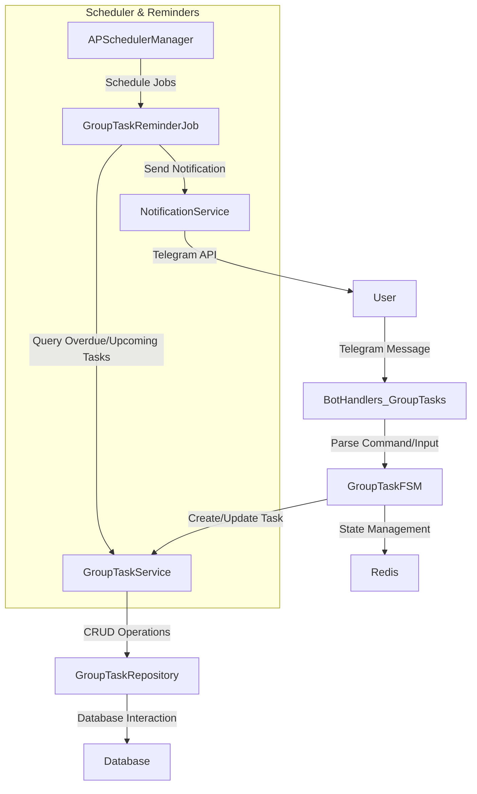

# System Architecture - Telegram Bot Automation Tool

## Tech Stack

| Layer | Choice | Justification |
|-------|--------|---------------|
| **Bot Framework** | `aiogram 3.x` | Native async, FSM built-in, middleware, active dev, type hints |
| **Scheduler** | `APScheduler 3.x` | Async support, persistent jobs, cron/interval triggers |
| **Database** | SQLite (dev) / PostgreSQL (prod) | SQLAlchemy abstracts both |
| **HTTP Client** | `httpx` | Modern async, HTTP/2, timeout handling |
| **ORM** | `SQLAlchemy 2.x + asyncpg` | Async-first, Alembic migrations |
| **Config** | `pydantic-settings` | Env validation, type coercion |
| **Container** | Docker + compose | Reproducible, easy orchestration |

## Project Structure

```
src/
├── main.py                    # Entry point
├── core/config.py             # Settings (working hours, timezone, reminder intervals)
├── database/
│   ├── models/task.py         # Task model with group task fields
│   ├── models/user.py         # User model
│   └── repositories/          # Data access layer
├── services/
│   ├── working-hours.py       # VN timezone working hours validation
│   ├── group-task-service.py  # Group task CRUD + workflow
│   ├── task-service.py        # Personal task service
│   └── notification.py        # Telegram notification service
├── scheduler/
│   ├── manager.py             # APScheduler singleton
│   └── jobs/
│       ├── notify.py          # Personal task reminders
│       └── group-task-reminder.py  # Group reminders, overdue, cleanup
└── bot/
    ├── handlers/
    │   ├── commands.py        # /start, /help, /status
    │   ├── tasks.py           # Personal task handlers
    │   ├── group-tasks.py     # Group task commands
    │   └── group-task-fsm.py  # Multi-step task creation
    ├── keyboards/
    │   ├── inline.py          # General keyboards
    │   └── group-task-keyboards.py  # Group task keyboards
    └── middlewares/           # Rate limiting, auth, session
```

## Core Modules

| Module | Responsibility |
|--------|----------------|
| `bot/handlers` | Process commands/callbacks, delegate to services |
| `bot/middlewares` | Auth, rate limiting, logging |
| `bot/keyboards` | Generate inline and reply keyboards |
| `scheduler/manager` | APScheduler with SQLAlchemy job store for task reminders |
| `scheduler/jobs` | Contains specific jobs like `group-task-reminder.py` and `notify.py` |
| `services/` | Business logic for personal tasks, group tasks, working hours, and notifications |
| `database/models` | Defines database models (User, Task) |
| `database/repositories` | Data access layer for interacting with the database |
| `core/config` | Environment-based settings via pydantic-settings |

## Configuration

```python
# core/config.py
from pydantic_settings import BaseSettings

class Settings(BaseSettings):
    BOT_TOKEN: str
    ADMIN_IDS: list[int] = []
    DATABASE_URL: str = "sqlite+aiosqlite:///./dev.db"
    SCHEDULER_JOBSTORE_URL: str | None = None
    API_BASE_URL: str = ""
    API_KEY: str = ""
    class Config:
        env_file = ".env"
```

## Deployment (Docker)

```yaml
# docker-compose.yml
services:
  bot:
    build: .
    env_file: .env.prod
    depends_on: [db]
    restart: unless-stopped
  db:
    image: postgres:16-alpine
    volumes: [postgres_data:/var/lib/postgresql/data]
    environment:
      POSTGRES_DB: telegram_bot
      POSTGRES_USER: bot
      POSTGRES_PASSWORD: ${DB_PASSWORD}
volumes:
  postgres_data:
```

```dockerfile
# Dockerfile
FROM python:3.12-slim
WORKDIR /app
COPY requirements.txt .
RUN pip install --no-cache-dir -r requirements.txt
COPY src/ ./src/
COPY alembic/ ./alembic/
CMD ["python", "-m", "src.main"]
```

## Data Flow - Group Task Management



## Design Decisions

1.  **Repository Pattern** - Isolate DB interaction logic from business logic, allowing easy database swapping.
2.  **Service Layer** - Centralize business logic, ensuring thin handlers and reusable code.
3.  **Async Everything** - Non-blocking I/O operations for high concurrency and responsiveness.
4.  **Config via Env** - Adhere to 12-factor app principles using pydantic-settings for environment-based configuration.
5.  **Files <200 Lines** - Promote single responsibility and improve testability and maintainability.
6.  **FSM for Multi-step Conversations** - Use aiogram's FSM for complex user interactions like task creation, ensuring a guided and robust experience.
7.  **Dedicated Group Task Module** - Separate services, handlers, and keyboards for group tasks to maintain modularity and clear responsibility.

## Dependencies

```txt
# requirements.txt
aiogram>=3.4
APScheduler>=3.10
SQLAlchemy[asyncio]>=2.0
asyncpg
aiosqlite
httpx
pydantic-settings>=2.0
alembic
redis>=5.0.1
babel>=2.13.1
loguru>=0.7.2
```
